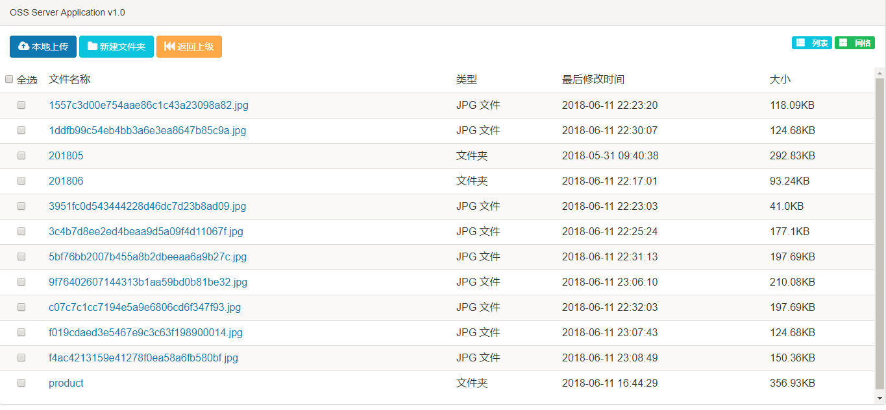
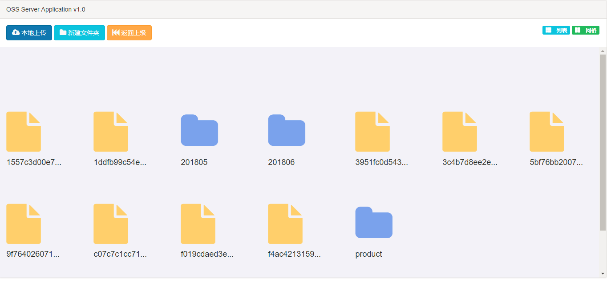

**项目文档地址：http://oss-server.mydoc.io**

**oss-server项目交流群：608374991**

## 项目介绍

oss-server是针对项目开发时提供的小型对象存储系统,开发者在针对文件上传时业务剥离,同时方便文件迁移，为满足单个项目，多个系统的情况下，提供统一的oss服务

oss-server主要提供功能：

>  1、上传功能
>
> 2、文件在线管理功能(包括文件的预览、内部上传、删除、更名)
>
> 3、权限管理(上传api权限用户维护、oss-server登录系统维护)

oss-server使用tomcat+nginx的方式，tomcat提供上传对象存储的能力，nginx提供在线访问的能力

oss不提供文件相关日志存储功能，是纯技术中间件

server端主要配置(`application.properties`)如下：

```properties
#素材存储路径 -- 以/结尾
material.root=/home/material/
#素材下载路径根目录,该目录是nginx读取目录,可以使用域名
material.invokingRoot=http://192.168.0.7/
```

使用以上配置，服务端nginx配置如下：

```nginx
server{
        listen          80;
        server_name 192.168.0.7;
        charset utf-8;
        location / {
           root /home/material/;
        }
    }
```

该配置只是简单配置nginx访问路径,server_name可以是域名.

### 管理员预览

输入访问路径：http://ip:port/

输入`application.properties`配置文件中的用户名密码:

```text
#验证用户名 密码
oss.security.userName=admin
oss.security.password=adminA123
```





oss-server提供以下两种提交方式

### base64字符串格式提交

该方式是后端需要将文件转换成base64字符串,提交给oss-server，该方式oss-server提供了java版的sdk，具体可参看`oss-server-sdk-java`程序

请求接口：`/oss/material/uploadByBinary`

接口类型：`post`

请求类型：`application/json;`

请求参数：

```json
{
    "project": "",
    "files": [
        {
            "original_name": "test.png",
            "file": "文件流base64字符串",
            "media_type": "png"
        }
    ]
}
```

**字段说明**：

| 参数          | 说明                                                         |
| ------------- | ------------------------------------------------------------ |
| project       | 项目名称，oss-server会根据该名称创建项目目录,方便后续程序迁移 |
| files         | 上传文件数组                                                 |
| original_name | 文件原始名称                                                 |
| file          | 文件流base64字符串                                           |
| media_type    | 文件格式类型                                                 |

**响应json**

```json
{
    "code": "8200",
    "message": "Success",
    "data": [{
        "id": "1a4c705d260647cc9be951ead3a449e6",
        "url": "http://192.168.0.7/province_IIII/201805/30/1a4c705d260647cc9be951ead3a449e6.jpg",
        "store": "/province_IIII/201805/30/1a4c705d260647cc9be951ead3a449e6.jpg"
    }]
}
```

**响应参数说明**

| 参数    | 说明                   |
| ------- | ---------------------- |
| code    | 错误码,8200为成功      |
| message | 错误信息               |
| data    | 上传成功后文件返回信息 |
| id      | 文件唯一标识           |
| url     | 文件在线访问url        |
| store   | 文件静态存储路径       |

### form表单直接提交

该方式前端可直接通过form提交上传,后端不需要提供中转

请求接口：`/oss/material/{project}/uploadMaterial`

接口类型：`post`

请求参数：

| 参数    | 说明                                                         |
| ------- | ------------------------------------------------------------ |
| project | 项目名称，oss-server会根据该名称创建项目目录,方便后续程序迁移 |
| module  | 模块名称，可为空,很多情况下,我们希望分模块来存储我们的上传资源，这个时候，可以使用该module字段，例如：`/product/wechat`,此时,oss生成的全路径是：`{project}/product/wechat/...` |
| file    | 上传文件名称，可以是数组多个文件                             |

**响应json**

```json
{
    "code": "8200",
    "message": "Success",
    "data": [{
        "id": "1a4c705d260647cc9be951ead3a449e6",
        "url": "http://192.168.0.7/province_IIII/201805/30/1a4c705d260647cc9be951ead3a449e6.jpg",
        "store": "/province_IIII/201805/30/1a4c705d260647cc9be951ead3a449e6.jpg"
    }]
}
```

**form表单代码示例如下**

```html
<!DOCTYPE HTML PUBLIC "-//W3C//DTD HTML 4.0 Transitional//EN">
<html>
<head>
    <meta http-equiv="Content-Type" content="text/html; charset=utf-8"/>
    <meta http-equiv="X-UA-Compatible" content="IE=edge,chrome=1"/>
    <title>Title</title>
    <script src="https://cdn.bootcss.com/jquery/3.2.1/jquery.min.js"></script>
</head>
<body>
<form action="http://192.168.0.7:18000/oss/material/province_III/uploadMaterial" method="post" enctype="multipart/form-data" target="uploadIFrame">
    <input type="file" name="file" value="选择文件"/>
    <input type="submit" value="提交"/>
</form>

<iframe name="uploadIFrame" style="width: 500px;height: 500px;border: 1px solid gray;"></iframe>
</body>
</html>
```

## 软件架构

后端框架：SpringBoot 2.0.2.RELEASE

后端模块：freemarker

前端框架：layer+Bootstrap

## 安装教程

1、下载源码：`git clone https://gitee.com/xiaoym/oss-server.git`

2、修改application.properties配置文件,主要修改以下oss对外域名路径已经上传存储路径

```java
#素材存储路径 -- 以/结尾
material.root=/home/material/
#素材下载路径根目录
material.invokingRoot=http://192.168.0.7/
```

3、打包：`mvn package`

4、运行jar包：`java -jar oss-server-0.0.1-SNAPSHOT.jar`

## 参与贡献

1. Fork 本项目
2. 新建 Feat_xxx 分支
3. 提交代码
4. 新建 Pull Request

## 交流

